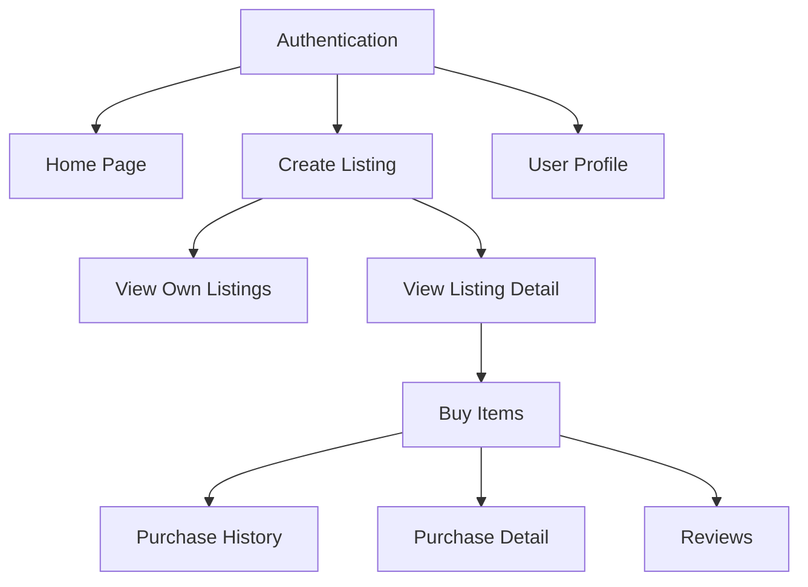

# Implementation Priority Order

## Phase 1: Core Authentication & Basic Structure
1. **User Story 2: Register and Login**
   - Basic user authentication is required for most features
   - Core requirement for user-specific actions
   - Dependencies: None
   - Key Features:
     - User registration
     - Email verification
     - Login/Logout
     - Password reset

2. **User Story 1: Home Page**
   - Basic listing display
   - Category navigation
   - Search and filter functionality
   - Dependencies: Basic database structure
   - Key Features:
     - Grid layout of listings
     - Basic search
     - Category filtering
     - Sorting options

## Phase 2: Listing Management
3. **User Story 3: Create Listing**
   - Allow users to create listings
   - Image upload functionality
   - Category selection
   - Dependencies: Authentication, Categories
   - Key Features:
     - Form for listing creation
     - Image upload (max 4 photos)
     - Category selection
     - Price and description

4. **User Story 4: View Own Listings**
   - Manage personal listings
   - Edit/Delete functionality
   - Dependencies: Create Listing
   - Key Features:
     - List view of own listings
     - Edit capability
     - Delete functionality
     - Status management

5. **User Story 5: View Listing Detail**
   - Detailed product view
   - Image gallery
   - Seller information
   - Dependencies: Create Listing
   - Key Features:
     - Full listing details
     - Image gallery
     - Seller info
     - Action buttons

## Phase 3: User Profile & Management
6. **User Story 8: View Profile**
   - Profile management
   - User settings
   - Activity tracking
   - Dependencies: Authentication, Listings
   - Key Features:
     - Profile information
     - Activity history
     - Settings management
     - Avatar upload

## Phase 4: Purchase & Transaction
7. **User Story 9: Buy Items**
   - Purchase flow
   - Stripe integration
   - Order creation
   - Dependencies: Listing Detail, User Profile
   - Key Features:
     - Purchase flow
     - Payment integration
     - Order creation
     - Notifications

8. **User Story 10: View Purchase History**
   - Purchase list
   - Order tracking
   - Dependencies: Buy Items
   - Key Features:
     - Purchase history
     - Order status
     - Filtering options
     - Export functionality

9. **User Story 11: View Purchase Detail**
   - Order details
   - Payment information
   - Shipping tracking
   - Dependencies: Buy Items
   - Key Features:
     - Detailed order info
     - Payment details
     - Shipping tracking
     - Order actions

## Phase 5: Reviews & Interaction
10. **User Story 7: Reviews System**
    - Product reviews
    - Rating system
    - Dependencies: Buy Items (users can only review after purchase)
    - Key Features:
      - Review creation
      - Rating system
      - Review management
      - Review display

## Technical Dependencies Graph

## Implementation Notes
1. Each phase should be completed and tested before moving to the next
2. Core functionality (Auth, Listings) must be solid before building purchase system
3. Review system comes last as it depends on completed purchases
4. Each feature should include:
   - Unit tests
   - Integration tests
   - Documentation
   - Security review

## Risk Mitigation
- Start Stripe integration early in development to handle potential issues
- Implement proper error handling from the beginning
- Ensure robust testing of authentication system
- Plan for data migration and schema changes
- Consider scalability in initial architecture 